# Benchmark results

Full results for the benchmark summarised in the [README](../../README.md#benchmark), which gives the slowest and the fastest of the ten documents. Weighted by the time each document takes, which lets the 48.8 MB `fgo` and the 66.4 MB `otfcc` decide the total, cpp-yyjson reads 1.69x faster than [yyjson](https://github.com/ibireme/yyjson), 2.14x faster than [simdjson](https://github.com/simdjson/simdjson) DOM and 2.31x faster than [rapidjson](https://github.com/Tencent/rapidjson/), and writes 1.46x faster than [yyjson](https://github.com/ibireme/yyjson), 3.91x faster than [rapidjson](https://github.com/Tencent/rapidjson/) and 6.67x faster than [nlohmann-json](https://github.com/nlohmann/json). Much of that weight is the [huge-page advice](#allocator) of the bundled backend, which only the two large documents receive; with the parser and allocator reused on both sides, cpp-yyjson is 1.19x ahead of [simdjson](https://github.com/simdjson/simdjson) On Demand on a prepared padded buffer, against 1.34x with them fresh.

1.  [Method](#method)
2.  [Read performance](#read-performance)
3.  [Write performance](#write-performance)

## Method

**Environment.** Ubuntu 26.04.1 LTS with Linux 7.0.0, Intel Core i9-12900K with 8 logical CPUs (E-cores and Turbo Boost disabled), compiled with GCC 15.2.0. Each result is the median of at least 11 repetitions on [google benchmark](https://github.com/google/benchmark) v1.9.5, repeated up to 101 times until the relative standard error of the median is below 0.5%. Every benchmark runs in its own process.

**Libraries.** The vcpkg manifest (baseline `cd61e1e`) provides [yyjson](https://github.com/ibireme/yyjson) 0.12.0, [simdjson](https://github.com/simdjson/simdjson) 4.6.4, [rapidjson](https://github.com/Tencent/rapidjson/) 2025-02-26 and [nlohmann-json](https://github.com/nlohmann/json) 3.12.0#2. The datasets are those of [yyjson_benchmark](https://github.com/ibireme/yyjson_benchmark#json-datasets).

**Build.** All four benchmark executables are built with `-O3`, `-march=x86-64-v3` and link-time optimization; they share the measured code, so a flag given to one of them would show up as a difference between the libraries. cpp-yyjson uses the bundled backend with AVX2 enabled, optimized together with the benchmark. [rapidjson](https://github.com/Tencent/rapidjson/) and [nlohmann-json](https://github.com/nlohmann/json) are header-only and compiled with the same options. [simdjson](https://github.com/simdjson/simdjson) and [yyjson](https://github.com/ibireme/yyjson) are the prebuilt vcpkg libraries, built without `-march=x86-64-v3` or link-time optimization; only the inline part of `yyjson.h` is compiled into the benchmark. simdjson 4.6.4 exports its API-misuse checks (`SIMDJSON_DEVELOPMENT_CHECKS`) to release builds; the benchmarks remove them from the inlined code, which includes all of On Demand.

**Allocator.** glibc's allocator is left at its defaults, except that each process frees one 16 MiB block before measuring. That raises glibc's dynamic `mmap` and trim thresholds as in any long-running program; without it, whether a fresh allocator returned its memory to the kernel after every parse depended on what the process had freed before, and some rows doubled. Blocks above 32 MiB are still mapped afresh on every allocation. For those blocks the bundled backend, and only it, calls `madvise(MADV_HUGEPAGE)` (Linux with glibc; disabled by `YYJSON_DISABLE_HUGE_PAGES`), which in Ubuntu's default `madvise` mode cuts their page faults by up to 512 times. The rows of `fgo` and `otfcc` with a fresh allocator therefore reflect this platform; elsewhere, and for the other libraries, reusing the allocator is what avoids the faults.

The benchmark programs are in [`test`](../../test), and [`run_benchmarks.sh`](run_benchmarks.sh) reproduces the results and the charts. The raw logs are [cpp_yyjson_bench_read.log](../../test/cpp_yyjson_bench_read.log), [yyjson_bench_read.log](../../test/yyjson_bench_read.log), [cpp_yyjson_bench_write.log](../../test/cpp_yyjson_bench_write.log) and [yyjson_bench_write.log](../../test/yyjson_bench_write.log). All times are in `ms`.

## Read performance

Each measurement parses a document and visits all of its elements. The parsing methods of the libraries are not interchangeable, because some require a buffer that is writable, padded and safe to destroy, so the charts are separated by what the caller can guarantee about the input:

*Read-only fixed-length input*
: A plain read-only string, as received from a file or a network. In-situ parsing needs a copy first, and rows marked `copy + in-situ` or `copy + pad` include that copy and its padding in the measured time.

*Caller-prepared writable/padded buffer*
: The caller already owns a buffer that may be destroyed, so its preparation is not measured. [rapidjson](https://github.com/Tencent/rapidjson/) needs no padding for in-situ parsing; [yyjson](https://github.com/ibireme/yyjson) and [simdjson](https://github.com/simdjson/simdjson) do.

Each chart is further split into a new parser/allocator per parse and a reused one, as in a server that reads many documents. cpp-yyjson and [yyjson](https://github.com/ibireme/yyjson) size a pool allocator from the input length, [rapidjson](https://github.com/Tencent/rapidjson/) takes allocators that are cleared after each parse, and a [simdjson](https://github.com/simdjson/simdjson) parser is reusable. In the reused section of the read-only input, every library also reuses the buffer it copies the input into, so the two sections differ only in the reuse.

[simdjson](https://github.com/simdjson/simdjson) offers "DOM" and "On Demand". On Demand is faster but is a forward-only iterator over a padded input, so it appears only as a padded row.

### Read-only fixed-length input

</img>
</img>
</img>
</img>
</img>
</img>
</img>
</img>
</img>
</img>

### Caller-prepared writable/padded buffer

</img>
</img>
</img>
</img>
</img>
</img>
</img>
</img>
</img>
</img>

### Findings

**Against [yyjson](https://github.com/ibireme/yyjson).** cpp-yyjson is faster on every document, by an amount that depends on the content: it takes 57% and 66% of the time on the string-heavy `gsoc-2018` and `github_events`, 71% and 78% on the indented `citm_catalog` and `twitter`, and 88% on the number-heavy `canada`. On `fgo` and `otfcc` it takes 56% and 60%, mostly because of the huge pages; with the allocator reused on both sides it takes 91% and 96%. Both run the same parser, built differently: measured separately, the SIMD string paths account for the gains on the string-heavy documents, skipping predicted indentation for those on the indented ones, and link-time optimization for a few percent everywhere. The C++ interface itself costs nothing measurable.

**Against [simdjson](https://github.com/simdjson/simdjson).** On a prepared buffer cpp-yyjson is ahead of On Demand on all ten documents, by 6% on `twitter` to 53% on `twitterescaped`, and by 7% to 53% with the parser and allocator reused. The margin on `fgo` and `otfcc` is 45% and 30% fresh against 18% and 19% reused, the difference being the huge pages. simdjson is a prebuilt library too, but selects its SIMD kernels at run time and so uses the full instruction set of this machine.

**Reusing the allocator** saves a fifth on `fgo` and `otfcc` (55.2 to 45.2 ms and 122.0 to 100.0 ms) and nothing on the eight smaller documents, because only the large documents need blocks that glibc maps afresh on every parse.

**In-situ parsing** pays off only when the caller already owns the buffer. On a read-only input the copy cancels the gain on the eight smaller documents and costs 26% and 16% on `fgo` and `otfcc`, because the copy is a `std::string` that gets no huge pages.

## Write performance

Writing is measured in two ways:

*Document serialization*
: The ten datasets are parsed outside the measurement, and each library turns its own document back into JSON text. These charts compare cpp-yyjson with the other libraries.

*Document building*
: An array or object of 1,000,000 elements is built and serialized. These charts compare cpp-yyjson only with the [yyjson](https://github.com/ibireme/yyjson) C API, one row per code path of the interface, to show what the C++ layer costs.

[simdjson](https://github.com/simdjson/simdjson) has no serializer and is absent from both.

### Document serialization

Each chart is split into a new output buffer per write, which is what `dump()`-style interfaces do, and a reused one. cpp-yyjson and [yyjson](https://github.com/ibireme/yyjson) reuse an allocator and [rapidjson](https://github.com/Tencent/rapidjson/) its `StringBuffer`; [nlohmann-json](https://github.com/nlohmann/json) always returns a new `std::string` and appears only in the first section.

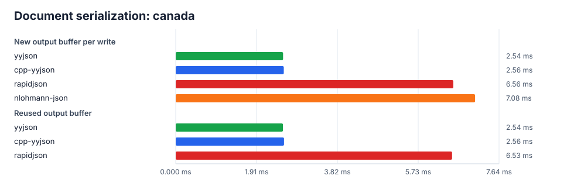</img>
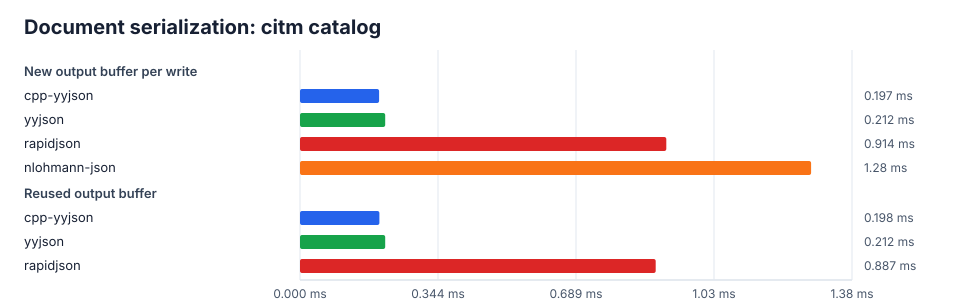</img>
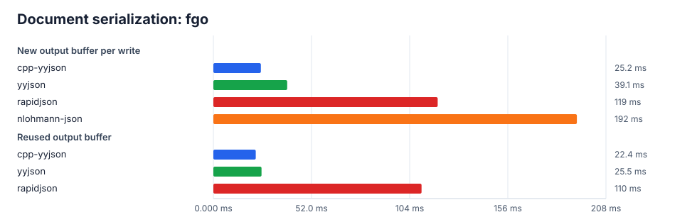</img>
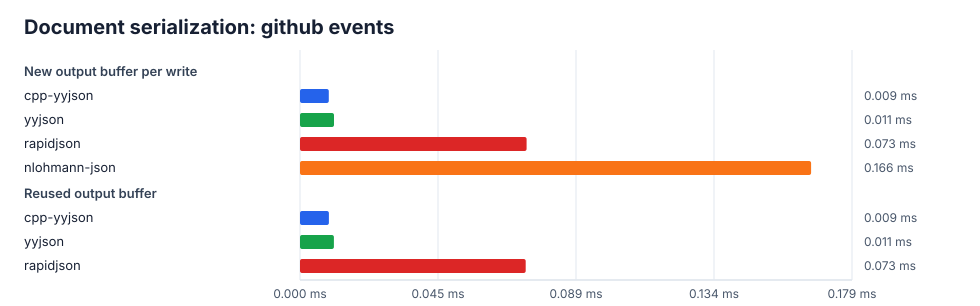</img>
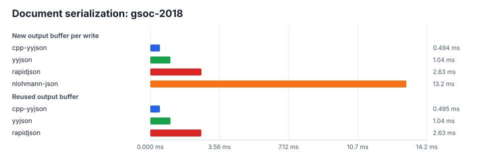</img>
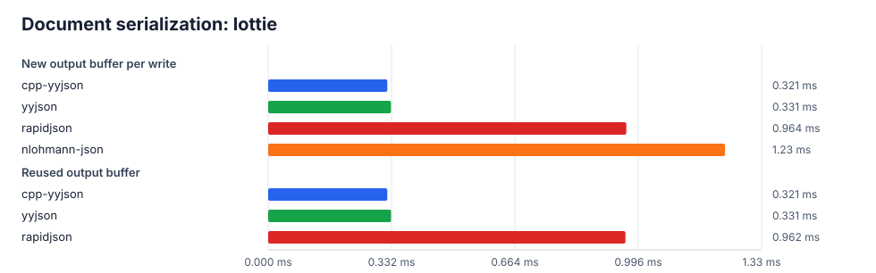</img>
</img>
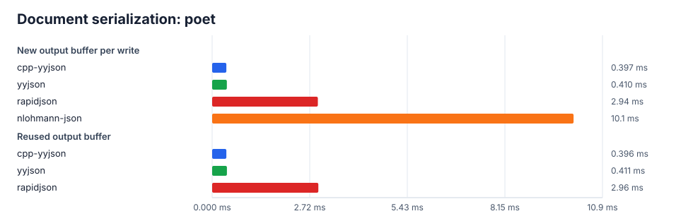</img>
</img>
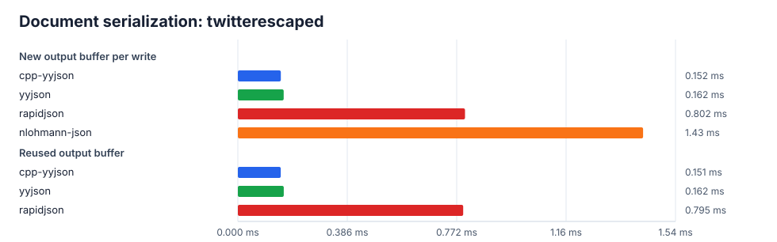</img>

### Document building

The cpp-yyjson rows are labelled by the API used:

*cpp-yyjson*
: A new document for each iteration.

*cpp-yyjson single*
: The same with one allocator reused across iterations.

*cpp-yyjson range*
: A whole range converted into an array in one call instead of appended element by element.

*cpp-yyjson reflection* / *cpp-yyjson macro*
: A user-defined struct converted by compile-time field reflection or by `VISITABLE_STRUCT` registration.

The `*_string` and `*_string_copy` charts differ in whether the strings are referenced or copied into the document. `array_string` and `array_long_string` write the same number of characters, a million strings of about six characters against ninety thousand of sixty-four, so they differ only in the length of a string.

</img>
</img>
</img>
</img>
</img>
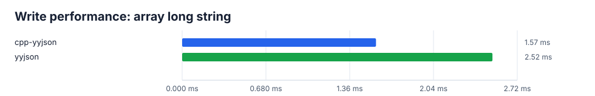</img>
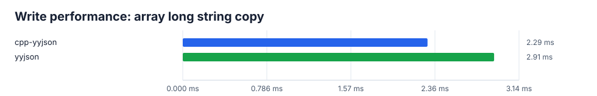</img>
</img>
</img>
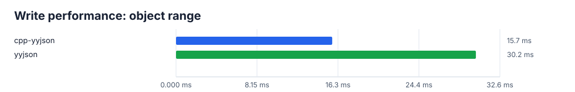</img>
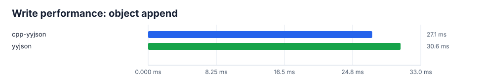</img>
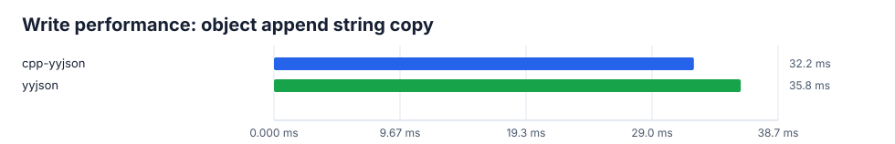</img>

### Findings

**Serialization.** cpp-yyjson writes every document in 12% to 39% of the time of [rapidjson](https://github.com/Tencent/rapidjson/) and 4% to 36% of that of [nlohmann-json](https://github.com/nlohmann/json), the widest margins on the documents with the most text. Against [yyjson](https://github.com/ibireme/yyjson) it takes 48% on `gsoc-2018`, which is dominated by long strings and gains from the SIMD string writer, 82% on `github_events`, and 90% to 97% on five others, with `canada` level. `fgo` and `otfcc`, at 64% and 69%, gain mostly from the huge pages of their output buffers, and reusing the output buffer saves 11% and 9% on them (25.2 to 22.4 ms and 47.0 to 43.0 ms) and nothing elsewhere.

**Building.** cpp-yyjson is level with the C API wherever both do the same work, such as `array_double_append`, which is within 1%. Converting a whole range in one call is 15% faster on `array_string` and 2-3% on `array_int64` and `array_double`, because the elements are counted first and written into one block instead of appended one at a time. The long-string rows are 38% and 21% faster because the bundled backend copies strings in SIMD chunks. `array_tuple`, `array_object`, `object_range`, `object_append` and `object_append_string_copy` build documents with blocks over 32 MiB and are 10% to 48% faster, mostly from the huge pages, so they no longer isolate the cost of the interface.

**Choice of API.** Copying strings is a visible cost: `array_string_copy` takes 2.5 times as long as `array_string`, so referencing the strings is worthwhile when their lifetime allows it. Reflection costs no more than `VISITABLE_STRUCT` registration. Reusing the allocator makes no difference here, because these documents are built once per iteration and the allocator is not the bottleneck.
